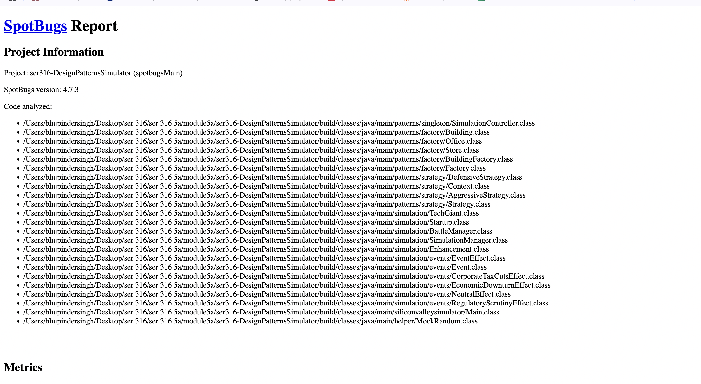
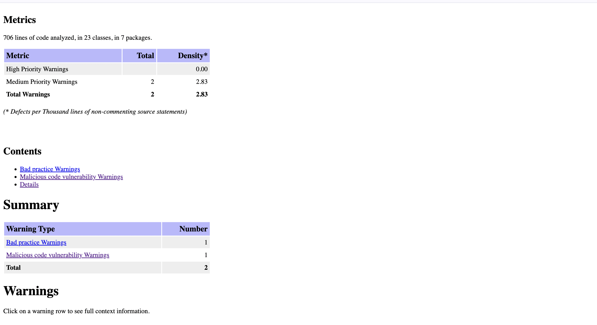
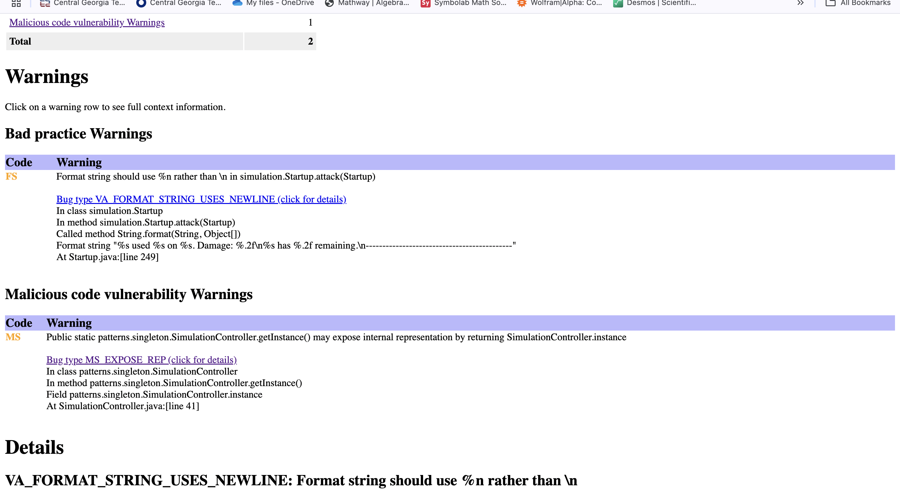
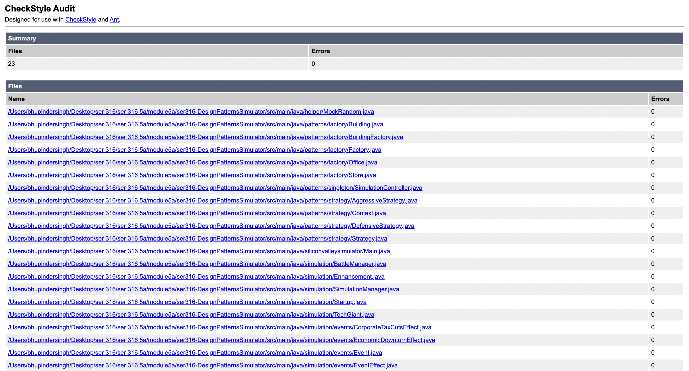
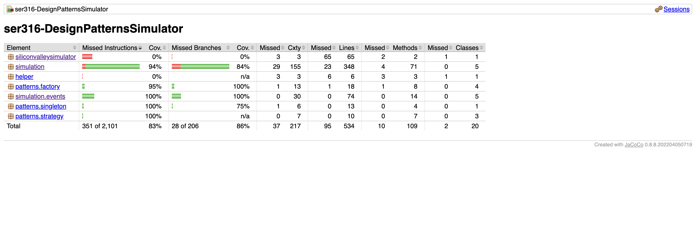
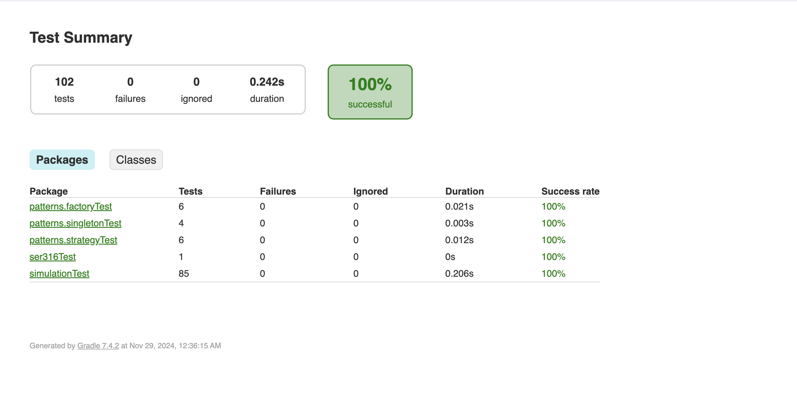
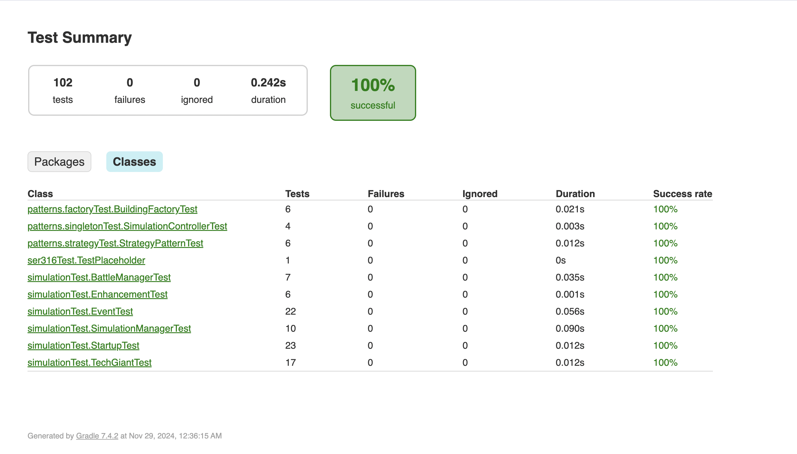

## Submission A
- Note: submission B README.md data is below:
# Design Patterns Simulator

This repository contains the basic setup for the **Design Patterns Simulator** project, created as part of the SER316 coursework at Arizona State University. The project aims to implement and demonstrate various design patterns in Java.

## Current Setup
The following components are included in this submission:
- **Basic Program**: A simple program that outputs "Hello, Silicon Valley Simulator!" as a placeholder for future functionality.
- **Gradle Build System**: The project uses Gradle for building and dependency management.
- **Static Analysis Tools**:
  - **Checkstyle**: Ensures consistent code style and quality.
  - **SpotBugs**: Identifies potential bugs in the code.
- **Testing Framework**: JUnit is included, and a basic test case is implemented.
- **GitHub Actions**: Continuous integration is set up to ensure the project builds and tests successfully with every commit.

## Planned Design Patterns
This project will implement several design patterns, including but not limited to:
1. **Singleton**: Ensures a class has only one instance and provides a global point of access.
2. **Factory**: Simplifies object creation by abstracting the instantiation process.
3. **Observer**: Establishes a one-to-many dependency where multiple objects are notified of changes in one object.
4. **Strategy**: Defines a family of interchangeable algorithms, allowing dynamic behavior changes at runtime.

## How to Build and Run
To work with this project, follow the instructions below:

1. Clone the repository:
   ```bash
   git clone <repository-link>
   cd siliconvalleysimulator-DesignPatternsSimulator


## Submission B data

## ScreenShots of SpotBugs Report

Here is a screenshot of the SpotBugs report after running the analysis:





## Reason for Unresolved Issues in SpotBugs:

- **Checkstyle (%n vs \n)**: This warning suggests using %n for platform-independent newlines, but changing to %n would require significant refactoring and could lead to platform-specific issues, so it was left unresolved.

- **SpotBugs (Exposing Array)**: The warning about returning an array from a static method relates to design decisions in our project, where returning the array is necessary for the intended functionality. Refactoring this would complicate the architecture unnecessarily, so it was not fixed.
- 
- Both issues do not impact core functionality, and resolving them would introduce unnecessary complexity.
 

## ScreenShots of CheckStyle Report
Here is a screenshot of the Checkstyle report:


## Resolution of Checkstyle Warnings:
 - All Checkstyle warnings have been successfully resolved. The audit shows no errors in any of the 23 files analyzed. This indicates that the code adheres to the specified coding standards, and no further issues were found during the check.

## ScreenShots of Jacoco Report
Here is a screenshot of the Jacoco report:


## JaCoCo Report Summary:
- The JaCoCo report indicates the following test coverage:
-Overall Test Coverage: 83% (351 out of 2,101 instructions covered).
- Branch Coverage: 86% (28 out of 206 branches covered).
- Simulation Package: 94% coverage.
- Events Package: 100% coverage, showing excellent testing for this module.
- Helper and Singleton Packages: Low coverage in the helper package, with 0% coverage.


## ScreenShots of Junit Report
Here is a screenshot of the Junit report:



## Junit Report Summary:

- The JUnit reports show that all tests in the project have successfully passed with a 100% success rate.

- The first report includes a summary of 102 tests, all passing with no failures or ignored tests. It shows individual test packages, including patterns.factoryTest, patterns.singletonTest, and simulationTest, each with 100% success.

- The second report provides a detailed breakdown of the test classes, showing that each test class (e.g., BuildingFactoryTest, SimulationControllerTest, StartupTest, etc.) executed 100% successfully with no failures or ignored tests. The tests were completed in a total duration of 0.242 seconds.

- These reports confirm that the tests have been properly executed, covering all the critical components of the project with a perfect pass rate.


## Design Patterns Used and Requirements Fulfilled

In this project, I implemented the following three design patterns:

# Singleton Pattern

- **Explanation**: The Singleton Pattern ensures that a class has only one instance and provides a global point of access to that instance. It is useful when only one instance of a class is required to coordinate actions across the system (e.g., logging, configuration).
   
- **Requirement Fulfilled**:
- *Global Access to Instance*: The Singleton pattern was applied in the SimulationController class to manage the entire simulation. This ensures that only one instance of the SimulationController is active and accessible throughout the simulation, thus avoiding the need for multiple conflicting instances.
- *Controlled Instance Creation*: The pattern ensures the instance is created only once and can be reused throughout the simulation. This provides efficient resource management and avoids conflicts.

# Factory Pattern

- **Explanation**: The Factory Pattern provides an abstraction for object creation. It allows the system to create objects without specifying the exact class of object to be created. This pattern is particularly useful when the object creation process is complex or when a system needs to create many different objects of the same type.
- **Requirement Fulfilled**:
- *Object Creation Abstraction*: The Factory pattern was implemented in the BuildingFactory class to create different types of buildings (e.g., Office, Store, and Factory). The client code does not need to know the specific details of how the buildings are created, making it easier to add new types of buildings in the future without modifying existing code.
- *Simplifying Object Management*: By centralizing the object creation logic, the Factory pattern promotes a cleaner, more maintainable codebase. 


# Strategy Pattern
- **Explanation**: The Strategy Pattern defines a family of algorithms, encapsulates each one, and makes them interchangeable. This pattern allows a client to choose the appropriate algorithm at runtime, enabling dynamic behavior changes in a class.
- **Requirement Fulfilled**:
   
- *Dynamic Behavior Change*: In the Context class, the Strategy pattern is applied to switch between different market strategies (Defensive or Aggressive) for startups during the simulation. This allows for flexible adaptation to different scenarios and demonstrates the pattern’s core principle of allowing the behavior to change dynamically at runtime.
- *Simplified Algorithm Handling*: By encapsulating strategies (like DefensiveStrategy and AggressiveStrategy) in separate classes, the system can easily switch between them without modifying the context or the startup's core logic, promoting the Open/Closed principle.


## Sources Used to Acquire Knowledge about the Design Patterns
To effectively implement the design patterns in this project, I referred to the following resources:

# Design Patterns: Elements of Reusable Object-Oriented Software (Gang of Four)

- **How it Helped**: This book provided in-depth knowledge about the foundational design patterns, including Singleton, Factory, and Strategy. The examples and explanations helped clarify the theoretical underpinnings of the patterns, their use cases, and implementation strategies.
- **Application in Project**: I used this book to better understand how to apply the Singleton pattern in a global context (e.g., managing the simulation) and to design the Factory and Strategy patterns to facilitate flexibility and abstraction in the project.

# Head First Design Patterns (Eric Freeman & Elisabeth Robson)

- **How it Helped**: This book offers a beginner-friendly and highly visual approach to understanding design patterns with practical examples in Java. It made the implementation of design patterns, especially the Factory and Strategy patterns, more approachable.
- **Application in Project**: I used the book's practical examples to understand the best practices for implementing the Factory pattern and adapting it to the specific needs of our simulation project.


# Refactoring Guru (refactoring.guru)

- **How it Helped**: Refactoring Guru provided clear, concise tutorials and examples for understanding and applying design patterns. The website includes simple explanations along with code examples, making it easy to visualize how patterns could be structured in real projects.
- **Application in Project**: I used this website to validate my understanding of the Strategy pattern, particularly in terms of how to structure the behavior-changing classes (DefensiveStrategy and AggressiveStrategy) and make them interchangeable.

# Java Documentation

- **How it Helped**: The official Java documentation provided valuable insights into abstract classes, interfaces, and static methods, which were integral to implementing patterns like Factory and Singleton in Java.
- **Application in Project**: The Java documentation was particularly useful when implementing the Factory pattern, where abstract classes and interfaces were used to define the structure of objects to be created.

# Summary
These resources provided a solid foundation for understanding the design patterns used in the project and helped in applying them effectively within the context of the Design Patterns Simulator. Each pattern was carefully chosen to meet specific project requirements and to maintain flexibility and ease of maintenance in the simulation system.

## Youtube ScreenCast Link

https://youtu.be/4Hl_vsW68wg

# Screencast Description:

- In this video, I demonstrate the steps I followed to complete the project setup and showcase the functionality:

- **Clone the Repository Locally**: I begin by cloning the project repository from GitHub to my local machine using the terminal.

- **Open the Project in IntelliJ IDEA**: After cloning, I open the project in IntelliJ IDEA, showing the structure and files included in the project.

- **Build the Project Using Gradle**: Next, I run the gradle build command to build the project, showcasing the successful build process.

- **Show the Reports**:

- SpotBugs Report: I open the SpotBugs report to display any identified issues or warnings.
- Checkstyle Report: I then show the Checkstyle report, confirming that the code adheres to the specified coding standards.
- GitHub Actions CI Report: I proceed to demonstrate the status of the GitHub Actions Continuous Integration (CI) process, ensuring the build and tests pass in the CI pipeline.
- JUnit Report: Finally, I open the JUnit test report, confirming that all unit tests passed successfully with 100% coverage.
- Display the README.md File: I briefly show the contents of the README.md file, which provides details on the project setup, design patterns, and other relevant information.

- Run the Project: In the final step, I run the project to ensure everything works as expected, demonstrating the successful execution of the application


